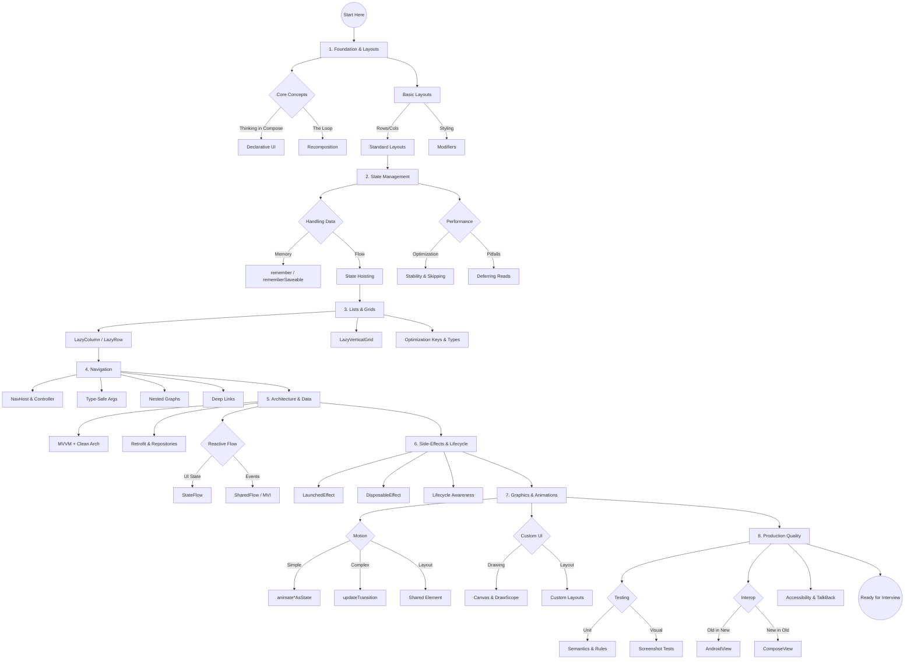

---
layout: default
title: Mindmap
parent: 17. Resources & Cheat Sheets
nav_order: 1
---

# Mindmap

Here is a text-based **Mindmap** of the entire syllabus we have covered.
You can use this to visualize the connections between topics.

---

# **Jetpack Compose: The Master Mindmap**

- **1. Foundation & Layouts**
- **Core Mental Model**
- Declarative UI (Describe _what_, not _how_)
- Recomposition (The loop: State changes -> UI redraws)
- Composables (`@Composable` functions)

- **Layouts**
- Standard: `Column`, `Row`, `Box`
- Scaffold: `TopBar`, `FAB`, `Drawer`
- Modifiers: Order matters (Size -> Padding -> Background)

- **2. State Management**
- **The Basics**
- `State<T>` / `MutableState<T>`
- `remember` (Survives recomposition)
- `rememberSaveable` (Survives rotation/death)

- **Patterns**
- State Hoisting (Unidirectional Flow)
- Stateless vs. Stateful Composables

- **Performance**
- Stability: `@Stable` vs `@Immutable`
- Skipping: Avoiding unnecessary redraws
- Pitfalls: Reading state in Composition vs. Draw phase

- **3. Lists & Grids**
- **Lazy Components**
- `LazyColumn` / `LazyRow`
- `LazyVerticalGrid`

- **Optimization**
- `key` (Smart updates)
- `contentType` (Recycling efficiency)

- **Features**
- Sticky Headers
- Pagination (Paging 3 integration)

- **4. Navigation**
- **Setup**
- `NavHost`, `NavController`, `NavGraph`
- Type-Safe Navigation (Serialization)

- **Structure**
- Nested Navigation (Sub-graphs)
- Bottom Bar & Rail Integration
- Deep Links (External URLs)

- **5. Side-Effects & Lifecycle**
- **APIs**
- `LaunchedEffect` (Suspend functions)
- `DisposableEffect` (Cleanup/Listeners)
- `SideEffect` (Publish to non-Compose)

- **Helpers**
- `rememberCoroutineScope` (Manual triggers like clicks)
- `rememberUpdatedState` (Fix stale lambdas)
- `produceState` / `snapshotFlow` (Bridges)

- **System**
- Lifecycle Awareness (`ON_START`, `ON_RESUME`)
- Back Handling (`BackHandler`)

- **6. Forms & Inputs**
- **Text**
- `TextField` / `OutlinedTextField`
- `VisualTransformation` (Passwords)
- Focus & Keyboard Actions (`ImeAction.Next`)

- **Selection**
- Pickers (Date/Time)
- `ExposedDropdownMenu`

- **Validation**
- Real-time feedback
- Derived state logic

- **7. Architecture (Clean MVVM)**
- **Layers**
- UI (Screen + ViewModel)
- Domain (UseCases - Pure Kotlin)
- Data (Repository + Retrofit)

- **State Flows**
- `StateFlow` (Persistent UI State)
- `SharedFlow` (One-off Events)
- `collectAsStateWithLifecycle`

- **MVI**
- Sealed Class Actions (`UserIntent`)
- Single Entry Point (`onEvent`)

- **8. Graphics & Custom UI**
- **Layouts**
- `ConstraintLayout` (References, Barriers)
- Custom Layouts (`measure` & `place`)

- **Drawing**
- `Canvas` (DrawScope)
- `graphicsLayer` (Rotation, Scale, Blur)

- **9. Animations**
- **State-Based**
- `animate*AsState` (Simple)
- `AnimatedVisibility` (Enter/Exit)
- `AnimatedContent` (Layout transitions)

- **Orchestrated**
- `updateTransition` (Synced values)
- Shared Element (Hero animations)

- **Gestures**
- `draggable` / `AnchoredDraggable`

- **10. Testing & Interop**
- **Testing**
- Semantics Tree & `testTag`
- `createComposeRule` (Isolated) vs `Android` rule
- Screenshot Testing (Paparazzi)

- **Interop**
- `ComposeView` (Compose inside XML)
- `AndroidView` (XML inside Compose)

- **Accessibility**
- TalkBack support (`mergeDescendants`)
- Font Scaling (`sp` vs `dp`)

- **11. Server-Driven UI (Advanced)**
- **Core**
- JSON Schema -> Registry -> Recursive Renderer

- **Logic**
- Versioning & Fallbacks
- Dynamic Action Handling

---

**This is the complete picture.**

---

## Navigation

Next →
